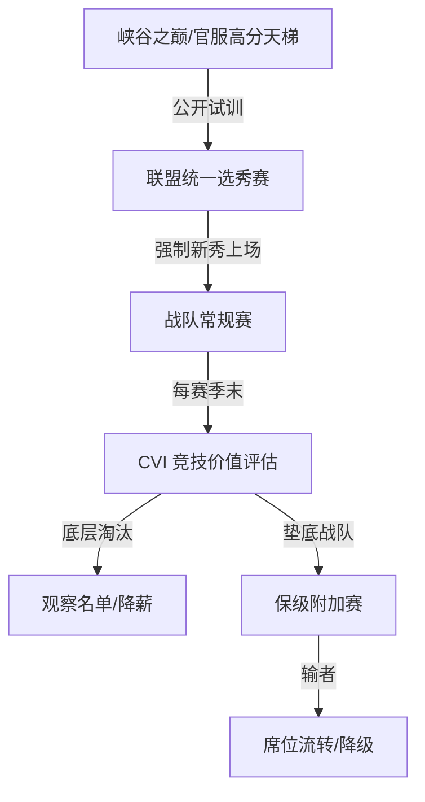

# LPL Challenge

这是一个面向 LPL 赛季改革的项目骨架，目标是把“战队保级、青训选拔与选手竞技价值评估”整理成可扩展的文档、数据与代码结构，并把这些方案变成更有说服力的可视化作品。

## 项目愿景

通过制度设计、模拟数据与可视化看板，帮助讨论 LPL 未来改革方案时更清楚地呈现：
- 哪些战队更容易面临保级风险；
- 选手与新秀如何通过制度获得更合理的出场机会；
- 如何用 CVI 等指标衡量选手长期价值，而非只看短期爆发。

## 核心模块

- 升降级与保级附加赛：将席位固化改为弹性升降级机制。
- 新秀强制出场：让战队必须在赛季中给新人真实出场机会。
- CVI 竞技价值指数：用数据指标替代“名气”与“老将惯性”。
- 社区协作：通过 Issue 模板，让粉丝和分析者参与讨论与反馈。

## 目录结构

- docs/：改革方案文档
  - 01_relegation_system.md
  - 02_talent_selection.md
  - 03_cvi_evaluation.md
  - 04_policy_modules.md
- data/：模拟样本数据
  - players_mock.json
  - policy_rules.json
  - teams_status.json
- src/：数据分析脚本与可视化系统
  - frontend/
  - backend/

## 快速开始

1. 查看文档：进入 docs/ 目录阅读改革方案说明。
2. 查看样例数据：在 data/ 目录中查看模拟的选手、战队和规则配置。
3. 浏览前端页面：打开 src/frontend/index.html 即可看到基础看板页面。
4. 运行分析脚本：在 src/backend/ 下执行 python analyze.py，查看 CVI 评分结果。

## 生态闭环

## 未来扩展方向

- 将 JSON 数据接入前端图表或分析脚本。
- 为后端增加数据库 schema 与 API 接口。
- 引入更细化的 CVI 计算与保级模拟逻辑。
- 接入 Supabase 或其他数据库服务，形成更完整的在线看板。

