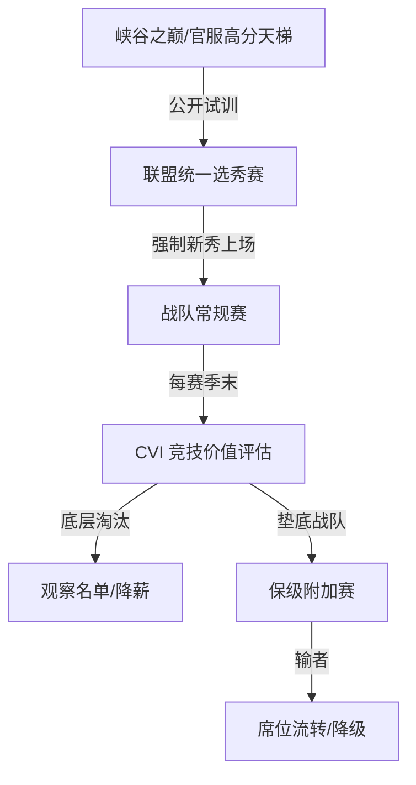

# LPL-challenge (LPL 破局者方案)

这是一个旨在打破当前 LPL “熟人圈子、资本摆烂、选手换汤不换药”僵局的开源制度提案与模拟项目。

## 🚨 核心痛点

1. 席位制变成免死金牌：底层战队靠吃联盟分红摆烂，毫无竞技压力。
2. 血氧输送带断裂：年轻天才因青训垄断与教练组保守主义无法出头。
3. 高薪低能老将内卷：部分选手竞技状态下滑，却能靠资历在各队反复横跳。

## 🛠️ 三大改革支柱

- 战队端：引入硬性升降级与消极运营“席位公开拍卖”机制。
- 选拔端：天梯直通车 + 强制新秀出场政策（Rookie Rule）。
- 退出端：基于大数据量化的“竞技价值指数（CVI）”末位淘汰制。

## 📂 目录导航

- [战队流转细则](docs/01_relegation_system.md)
- [新秀选拔机制](docs/02_talent_selection.md)
- [CVI 选手考核标准](docs/03_cvi_evaluation.md)
- [改革模块总览](docs/04_policy_modules.md)

## 🧪 项目目标

通过制度设计、模拟数据与可视化看板，帮助讨论 LPL 未来改革方案时更清楚地呈现：
- 哪些战队更容易面临保级风险；
- 选手与新秀如何通过制度获得更合理的出场机会；
- 如何用 CVI 等指标衡量选手长期价值，而非只看短期爆发。

## 📁 项目结构

- docs/：改革方案文档
- data/：模拟样本数据
- src/：前端看板、后端结构与未来分析脚本

## ▶️ 快速开始

1. 查看文档：进入 docs/ 目录阅读改革方案说明。
2. 查看样例数据：在 data/ 目录中查看模拟的选手、战队和规则配置。
3. 浏览前端页面：打开 src/frontend/index.html 即可看到基础看板页面。
4. 运行分析脚本：在 src/backend/ 下执行 python analyze.py，查看 CVI 评分结果。

## 🔄 生态闭环

## 🤝 如何贡献

欢迎电竞爱好者、数据分析师、前端/后端工程师提交 Issue 或 Pull Request，一起完善这套“热血重组”方案。

## 🔮 未来扩展方向

- 将 JSON 数据接入前端图表或分析脚本。
- 为后端增加数据库 schema 与 API 接口。
- 接入 Supabase 或其他数据库服务，形成更完整的在线看板。
- 引入更细化的 CVI 计算与保级模拟逻辑。

